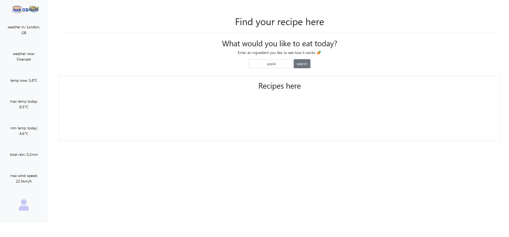
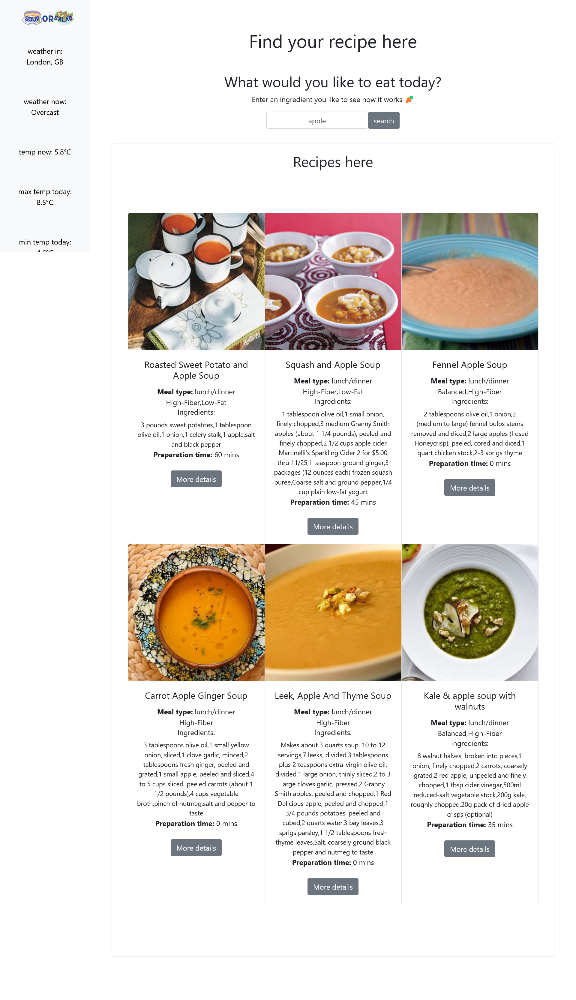

# slytherinWebApp
Project title: SOUP or SALAD
 
contributers: Moral, Victoria, Crystal

Project Description:
 
Soup or Salad is a fun suggestion web-based app providing a list of soup or salad recipes depending on weather conditions in the user's location. The user will be able to enter their location (which will be saved in the client-side and can be changed at any time), as well as an optional dietary profile, and 1-2 ingredients they currently have or are interested in using.
 
The app will then perform a search and return 5-8 soups/salads.

After researching and looking into APIs, we decided to use the ones below since they are both free and have straight forward instructions:

Weather API:
https://open-meteo.com/

Geographic location API:
https://geocoding-api.open-meteo.com/

Recipe API:
https://developer.edamam.com/

Target audience:
 
Millennials with decision fatigue, limited time and cooking skills. Looking for a fast and easy productive tool with minimal decisions required, to help them make food based on their location and dietary preferences.

User story:
 
As a millennial working as a developer:
 
I WANT to get an application which decides what I should eat on a gives day based on the weather of the city I'm in.
 
SO THAT I can easily decide what to eat without having to make too many decisions.

Below are 3 user stories to demonstate our target audience:
 
<strong>Max:</strong>
 
As a millennial working as a developer
I WANT to get an application which decides what I should eat on any given day based on the weather of the city I'm in.
SO THAT I can easily decide what to eat without having to make too many decisions.
 
<strong>Tracy:</strong>
 
As a new vegetarian, I want to explore into new vegan recipes that suits my busy schedule
This app is all I need to help me quickly get ingredients that I need for grocery shopping!
A time saver and fun application to give me recipe inspiration.

<strong>Becca:</strong>
 
Having recently moved to new zealand from Poland, I want to see what food I can make in this new weather based on the local groceries available here. I want to get an application which decides what I should eat for me, based on my environment and food preferences.

<strong>Instructions:</strong>
 
As the user opens the website, they will have the option to make a profile by clicking the profile icon in the bottom-left side-panel:

Here they will be able to select their location, and the option for selecting diet, health, and cuisine prefences:

After selecting the "save" button, they can go back to the home page and enter an ingredient to see a list of soups or salads using the ingredient typed by the user:

<strong>Challenges</strong>
1. Coordination of tasks:
- Group members weren't clear on what to do, so the same task was carried out by 2 members at once.
- Group members had different backgrounds and hence some found tasks very challenging and took more time to meet a goal than others would have.

2. Familiarity with tools:
- After discussing different task-assignment and communication tools, team members would have to also spend time learning to use the chosen tools.
- Significant time was also spent on learning about how to use chosen APIs and reading their documentation.

3. Time:
- Each member would have to explain changes they made, reasoning for it, and how it was done to others which consumed a lot of time
- Members would be late to meeting due to external conditions which cut off contact time in class
- All team members would have to agree on decisions such as defult setup for pages, logo, task assignment, etc. which would result in less time being left to focus on more detailed tasks.

Github url:
 
https://github.com/Slytherin-Frontend/soupOrSalad

Website url:
 
https://slytherin-frontend.github.io/soupOrSalad/

