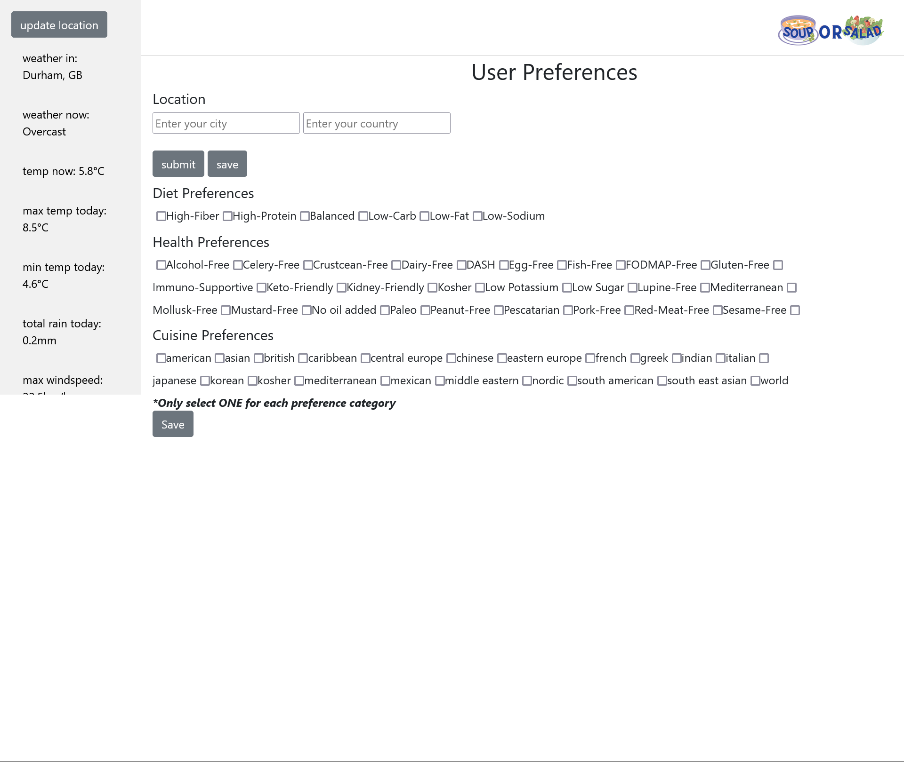

# slytherinWebApp
Project Title: SOUP or SALAD
contributers: Moral, Victoria, Crystal

Project Description:
Soup or Salad is a fun suggestion app providing a list of soup or salad recipes depending on weather conditions in the user's location. The user will be able to enter their location (which will be saved in the client-side and can be changed at any time), a dietary profile, and 1-2 ingredients they currently have or are interested in using; and the app will perform a search and return 5-8 soups/salads.

After researching and looking into 2 APIs, we decided to use the ones below sisnce they are both free and easy to use on their own:
Weather API:
https://open-meteo.com/

Geograohic location API:
https://geocoding-api.open-meteo.com/

Recipe API:
https://developer.edamam.com/

Target audience:
Millennials with decision fatigue, limited time and cooking skills. Looking for a fast and easy productive tool with minimal decisions required to help them make food based on their location and dietary preferences.

User story:
As a millennial working as a developer:
I WANT to get an application which decides what I should eat on a gives day based on the weather of the city I'm in. 
SO THAT I can easily decide what to eat without having to make too many decisions.

Below are 3 user stories to demonstate our target audience:
Max:
As a millennial working as a developer
I WANT to get an application which decides what I should eat on any given day based on the weather of the city I'm in.
SO THAT I can easily decide what to eat without having to make too many decisions.
 
Tracy:
As a new vegetarian, I want to explore into new vegan recipes that suits my busy schedule
This app is all I need to help me quickly get ingredients that I need for grocery shopping!
A time saver and fun application to give me recipe inspiration.

Becca:
Having recently moved to new zealand from Poland, I want to see what food I can make in this new weather based on the local groceries available here. I want to get an application which decides what I should eat for me, based on my environment and food preferences.

Instructions:
As the user opens the website, they will have the option to make a profile by clicking the profile icon in the bottom-left side-panel:

Here they will be able to select their location, and the option for selecting diet, health, and cuisine prefences:

After selecting the "save" button, they can go back to the home page and enter an ingredient to see a list of soups or salads that use the ingredient typed by the user:

Github url:
https://github.com/Slytherin-Frontend/soupOrSalad

website url:
https://slytherin-frontend.github.io/soupOrSalad/

